# My notes on DSA and leetcode questions

I'm making my detailed notes here as I'm re-learning DSA.
This can be useful to you even if you don't have any knowledge of DSA.

> **Warning:** This is in work in process

If you find something that I have written wrong or It could be explained in a better
way please submit an issue [here](https://github.com/siddharthroy12/My-DSA-Notes/issues).

Contributions are welcomed.

## Table of Contents

1. [Big O](#big-o)
    1. [How to calculate Big O](#how-to-calculate-big-o)
    2. [Space Complexity](#space-complexity)
    3. [Big O Cheat Sheet](#cheat-sheet)
2. [Data Structures](#data-structures)
    1. [Operations on Data Structures](#operations-on-data-structures)
    2. [Arrays](#array)
    3. [Hash Tables](#hash-tables)
    4. [Linked List](#linked-list)
    5. [Stacks and Queues](#stacks-and-queues)
    6. [Trees](#trees)
    7. Graphs
3. Algorithms
    1. Recursion
    2. Back Tracking
    3. Sorting
    4. BFS and DFS
    5. Dynamic Programming
5. How to solve coding problems
6. Coding Problems

## Big O

The Big O notation is used to show how well an algorithm scales
in terms of speed and space as the input grows.

It indicates how much time and memory an algorithm
will take to solve a problem for a given input.

Because a code can run faster or slower on different processors
it's not a good way to calculate the efficiency of a program.

That's why we use Big O notation to show how well a code performs
when the input grows.

Big O can also be plotted on a graph:


Note that even though O(n^2), O(2^n) and O(n!) are marked as horrible it's not always the case.

In some cases you cannot avoid having steep time complexities,
they can be the most efficient complexities for certain problems so keep that in mind.

### How to caculate Big O

To calculate Big O we need to calculate how many operations
the code/function/program will take for the given input.

For example this code:

```js
function getFirstElement(array) {
    return array[0];    // -- O(1)
}
```

This code returns the first element of an array
so it has only one operation so the Big O of this function is O(1).

Let's look at another example:

```js
function sumOfFirstTheeElements(array) {
    let res = 0;    //  -- O(1)

    for (let i = 0; i < 3; i++) {   // -- O(3)
        res += array[i];
    }

    return res;   // -- O(1)
}
```

You might think the Big O of this function is O(5) because
there are five operations in this code.

This is correct but as the input grows the number of operations
stays the same, it does not grow.

So it's a linear time which when denoted as O(1).

Let's look at a code where the numeber of operations grows as the input:

```js
function getIndexOf(array, element) {
    for (let i = 0; i < array.length; i++) { // -- O(n)
        if (array[i] === element) {
            return i;
        }
    }
}
```

This code will find the index of an element in an array by looping over each element.

So in the best case if the element is at the first index
it will only do one operation O(1) but in the worst case,
the number of operations will be equal to the number of inputs
which is denoted by O(n).

When we calculate the Big O we always take the worst case
so the Big O of this code is O(n).

Let's look at another similar example:

```js
function getIndexOfArrayAndSumOfFirstThree(array, element) {
    let index = 0;
    let sum = 0;

    for (let i = 0; i < array.length; i++) { // -- O(n)
        if (array[i] === element) {
            index = i;
            break;
        }
    }

    for (let i = 0; i < 3; i++) {   // -- O(3)
        sum += array[i];
    }

    return { index, sum };
}
```

Here we have a function that does two things:
    - Get the index of an element
    - Get the sum of the first three elements

You might think that the Big O of this function is O(n) + O(3) = O(n+3).
But we don't count the constant numbers like 3 because if the number of elements
is 1000 then having an extra 3 operation doesn't matter to us,
so we remove the constant and this becomes O(n).

> In big tech we often work with big amount of data

But what if we have two for loops?

```js
function getSumAndMultipleOfElements(array) {
    let sum = 0;
    let multiple = 0;

    for (let i = 0; i < array.length; i++) {   // -- O(N)
        sum += array[i];
    }

    for (let i = 0; i < array.length; i++) {   // -- O(N)
        multiple *= array[i];
    }

    return { sum, multiple };
}
```

We have to O(n) here so it should become O(2n) right?

Even though the graph of this is steeper than O(n)
it's still a straight line (a linear graph),
so once again we remove the constant and it becomes O(n).

For two separate collections:

```js
function getSumOfTwoArray(array1, array2) {
    let sum1 = 0;
    let sum2 = 0;

    for (let i = 0; i < array.length; i++) {   // -- O(N)
        sum1 += array1[i];
    }

    for (let i = 0; i < array.length; i++) {   // -- O(N)
        sum2 += array2[i];
    }

    return { sum1, sum 2};
}
```

People often confuse this as O(n) but this is incorrect.
Because we have two inputs we need to show two variables in the notation.
So this is O(a+b).

For nested loops:

```js
function getPairsOfElements(array) {
    let res = [];

    for (let i = 0; i < array.length; i++) {   // -- O(N)
        for (let j = 0; j < array.length; j++) {   // -- O(N)
            res.push([i,j]);
        }
    }

    return res;
}
```

For nested loops like this, we just multiply the operations,
so this becomes O(n * n) = O(n^2).

And the last rule:
Drop Non-dominant terms

```js
function getSumAndPairs(array) {
    let pairs = [];
    let sum = 0;

    for (let i = 0; i < array.length; i++) {   // -- O(N)
        for (let j = 0; j < array.length; j++) {   // -- O(N)
            pairs.push([i,j]);
        }
    }

    for (let i = 0; i < array.length; i++) {   // -- O(N)
        sum += array1[i];
    }
}
```

This looks like it has the complexity of O(n + n^2) but
because n^2 is way more important than n because it grows much faster than n.

When we calculate Big O we are concerned about the scalability of the function
and not the accurate speed of the function.

### Space complexity

Big O is not only used to calculate time compexity
it also used to calculate memory usage.

And there is relation between time and memory usage in computers.

If an algorithm uses less time then It will have to use more memory,
If an algorithm uses less memory then it will take more time to perform.

You cannot have the best of both worlds.

If you are writing a software that runs on low-end systems (like mico conrollers)
you wanna sacrifice speed for low memory usage.

And If you are writing a software that runs on a high-end system with lots of
data to process you wanna sacrifice memory usage for speed.

Let's look at an example to learn how to calculate space complexity:

```js
function sumOfFirstTheeElements(array) {
    let res = 0;    //  -- O(1)

    for (let i = 0; i < 3; i++) {   // -- O(1)
        res += array[i];
    }

    return res;
}
```

When we calculate space complexity we do not include the space occupied by the inputs.

Inside our function, we are only creating two variables and
it does not grow as the input grows so it's constant O(1).

Let's look at another example:

```js
function generateHelloArray(n) {
    let res = [];

    for (let i = 0; i < n; i++) {
        res.push("Hello");
    }

    return res;
}
```

The input n can also be an integer, not just an array.

Here we are creating an array inside the function and the length of the array
is the same as n so the space complexity of this is O(n).

### Cheat sheet

#### The most common Big Os

**O(1)** Constant - no loops

**O(log N)** Logarithmic - usually searching algorithms have log n
if they are sorted (Binary Search)

**O(n)** Linear - for loops, while loops through n items

**O(n log(n))** Log Linear - usually sorting operations

**O(n^2)** Quadratic - every element in a collection needs to be compared
to ever other element. Two nested loops

**O(2^n)** Exponential - recursive algorithms that solves a problem of size N

**O(n!)** Factorial - you are adding a loop for every element

#### Rules

- Always worst case
- Remove constants
  - O(n*2) => O(n)
  - O(n+100) => O(n)
  - O(n/2) => O(n)
- Different variables for different inputs
  - O(a + b)
  - O(a * b)
- Use + sign for loops in order
- Use * for nested loops
- Iterating through half a collection is still O(n)
- Drop Non-dominant terms
  - O(n + n^2) => O(n^2)

#### What Causes Time Complexity?

- Operations (+, -, *, /)
- Comparisons (<, >, ==)
- Looping (for, while)
- Outside Function call (function())

#### What Causes Space Complexity?

- Variables
- Data Structures
- Function Call
- Allocations

## Data Structures

To write an efficient software it's important to learn how to use these different
types of data structures and how they can improve the efficiency of your program.

### Operations on Data Structures

Data structures are simply ways to organise data on our computers and
each data structures have their tradeoffs, some are good at certain operations
and other are good at other operations.

The operations we are talking about are:

- Insertion: Adding more data
- Deletion: Deleting a data
- Traversal: Looping through all the data
- Searching: Searching for a data
- Sorting: Sorting all the data
- Access: Accessing a data

Here is a cheat sheet on operations for all data structures:
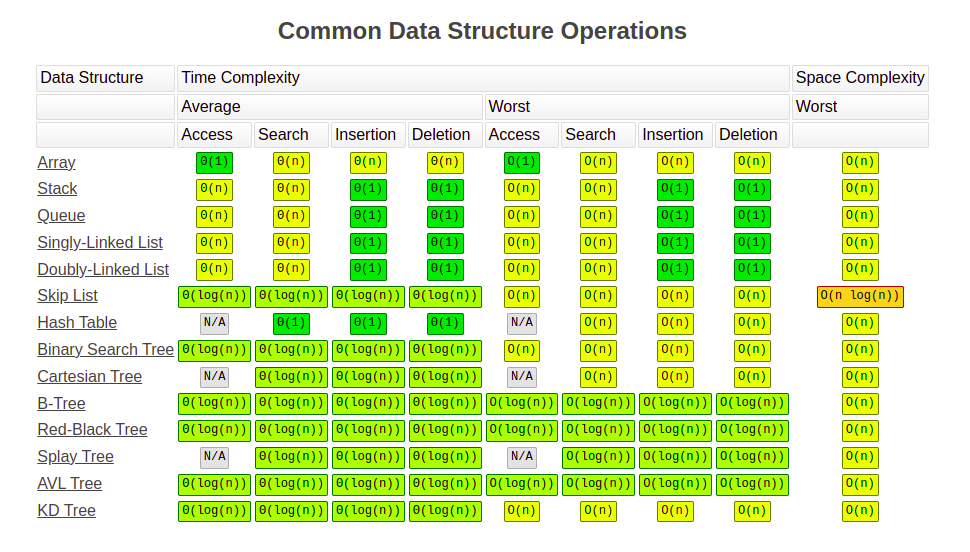

### Array

The most basic and commonly used data structure.
Elements of an array are placed next to each other in memory,
mapped with numbers starting at 0.

Elements of an array are stored sequentially, meaning if we have the address
of the first element of an array to access the second element all we need
to do is add one to the address and to access the second element add two, and so on.


This makes the access time O(1) if we know the index of our data.
But if you want to search for a data you need to loop over every element
one by one which makes the searching time O(n).

To calculate the length of the array we don't need to loop over the entire array,
we can just store the length of the array inside a variable/property
when we create the array (like in JS `array.length`) and increase/decrease this value
whenever we add or remove an element in the array.

And most languages provide this length property
so the access time of the last element of the array is also O(1).

But adding and removing an element is a different story.

Many languages provide two methods for array `push` and `pop` to insert
and remove an element at the end of the array.

`push` and `pop` have O(1) time complexity.

But if you want to add or remove an element anywhere else in the array
the elements after the index you just changed will have to re-order so in
the worst-case scenario the time complexity of inserting
and removing an element is O(n)

And strings are also an array of characters so the same applies to strings too.

#### Operations On Arrays

**Inserting** O(1) at the end and O(n) at the beginning.

**Deleting** Same as Inserting.

**Lookup** O(1).

**Searching** O(n).

#### Coding Problems

##### Reversing an array

Most programming languages provide a built-in method for reversing an array
but let's look at the ways we can implement this.

First, the most simple way to reverse an array:

```js
function reverse(input) {
    const output = [];

    for (let i = input.length-1; i >= 0; i--) {
        output.push(input[i]);
    }

    return output;
}
```

It loops through the array in reverse order and pushes the value into a new array.

The time and space complexity of this code is O(n), but we can improve this.

```js
function reverse(input) {
    let index1 = 0;
    let index2 = input.length-1;

    while(index2 > index1) {
        let tmp = input[index1];
        input[index1] = input[index2];
        input[index2] = tmp;
        index1++;
        index2--;
    }
}
```

In this function, we are using two indexes that point to the opposite sides
of the array and swap the values of the indexes as they move towards the center.

The above function has a space complexity of O(1) because
it creates a constant amount of space and mutates the input value instead.

This still has the time complexity of O(n) if you are confused.

Now, this function is a un-pure function because it is mutating the input value
which is not always an option so that's why
the previous solution was not that bad for reversing an array.

##### Merging sorted array

Let's solve a more complex interview question.

Q. Given two sorted arrays, merge them into one sorted array.

For example: `[0,4,6]` and `[2,3,7]` should become `[0,2,3,4,6,7]`

Answer:

To solve this problem we need to store two indexes.
[1] One will point to the first element of the first array and
the other one will point to the first element of the second array.

[2] Then compare the two values and increase the index pointing
to the shorter value and push the shorter value to the result array.

Keep doing this until one of the indexes hit the end
[3] then add the remaining elements to the result array.

```js
function mergeSortedArray(array1, array2) {
    // [1]
    let index1 = 0;
    let index2 = 0;
    let result = [];

    // [2]
    while(index1 < array1.length && index2 < array2.length) {
        if (array1[index1] < array2[index2]) {
            result.push(array1[index1]);
            index1++;
        } else {
            result.push(array2[index2]);
            index2++;
        }
    }

    // [3]
    while(index1 < array1.length) {
        result.push(array1[index1]);
        index1++;
    }
    while(index2 < array2.length) {
        result.push(array2[index2]);
        index2++;
    }

    return result;
}
```

Both the time and space complexity of this algorithm is O(a+b).

### Hash Tables

Map(C++), HashMap, Dictionary(Python), Object(JavaScript),and HashTable
are some of the ways to call this data structure and
different languages have slight variations of hash tables.

Hash tables are very important all across computer science.

Hash tables allow us to store data in a key-value pair and
this key is mostly a string or a number(we can use almost any type of data as key).


In hash tables we use key to find the value in memory,
unlike arrays in hash tables data is not stored in sequencial way
but still the access time of hash tables is O(1), it's constant.

Hash tables uses one-way hashing algorithm where the key is the input
and the output is the address in memory and this implementation
of this hashing algorithm is different in all languages.


#### Hash Function

Hash Function is again something that is used all across computer science.
A Hash Function is simply a function that generates a fixed-length string
that looks like some random gibberish for any given input. The output is called Hash.

Eg. `5d41402abc4b2a76b9719d911017c592`

You can play around with a famous hash function MD5 on [this website](http://www.md5.cz/).

There are some key aspects of hash functions:

- The function is a one-way function. Meaning there is no way to know
  what the input was by looking at the output.
- For the same input the output is always going to be the same
- If the input changes even by one bit, it's going to completely change the output

In hash tables, the hash function returns a memory address for a given input.
This makes accessing a block of memory by a key O(1) time.

This is extremely useful because now we can map data to a string(name, etc)
instead of a number like in an array.

The hash function takes some time to calculate the output and it can slow down
accessing data using HashTable. That's why in most languages the HashTable
is implemented by the most efficient hash function.

#### Hash Collisions

Hash Functions are great, they can generate a unique random string for a given input
and two different inputs cannot produce the same hash.

But when we use a hash table the range of the output of the hash function becomes limited.
So sometimes two different output results in the same address in the memory.

To deal with that different implementations have different methods. One of which is
Separate Chaining which uses a linked list to solve this issue but it slows down the
access time from O(1) to O(n) where n is the size of the linked list.

This is how it looks like:


Mostly you don't have to worry about Hash Collision happening
but it's good to know that this happens.

#### Coding Problems

##### First Recurring Element

Q. For a given array find the first recurring element

Example: [2,5,1,2,3,5,1,2,3] => 2

Answer:

To solve this problem we need to loop over every element of the array
and store the seen elements somewhere so that we can check if an element has
been seen before.

We will use hash table to store seen elments.

```js
function firstRecurringElement(input) {
  let seen = {};

  for (let i = 0; i < input.length; i++) {
    // Check if key exists
    if (seen[input[i]]) {
      return input[i];
    }

    // Otherwise store the key with any value
    seen[input[i]] = true;
  }

  // If no recurring element return false
  return false;
}
```

The time and space complexity of this is O(n).

#### Operations on Hash Tables

**Inserting** O(1).

**Deleting** O(1).

**Lookup** O(1).

**Searching** O(1) if searching using key, otherwise O(n).

### Linked List

As the name suggests it's a list that's linked. The best way
to explain this is using a diagram.

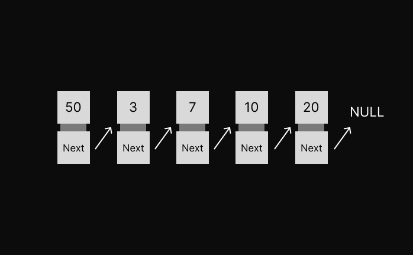

A linked list is a collection of Nodes, each Node has two
sections. One stores the data and the other points to the next Node in the list.

So how does this differs from an array?

In an array, all the elements are stored sequentially.
This mean if we have the address to the first element of the array
we can get the second element by just adding 1 to the address.

But In a linked list all the Nodes are stored in random places in memory.
So the access the second Node we need to use the pointer in the
first Node that is pointing to the second Node and so on.
The last Node points to nothing, that how we know it's the last Node.

Most programming languages don't come with linked list built-in
because nobody uses linked list in their applications.

#### Why Linked List?

You might be thinking if most programming languages don't come with
linked list and nobody uses them to develop their
application then why are we learning about this.

The reason is that while linked list alone is not very useful
in most situations it is a foundation for other very useful data structures
like Graph and Trees so it's important to know how to linked list
works if you want to learn about them.

#### Linked List vs Array

**Lookup**

In an array, accessing an element by index has O(1) time complexity.

But in Linked List because data is not stored in sequence in the memory
we need to iterate through one Node to another to get to the desired element.

**Prepend**

Adding an element at the beginning of an array has O(n) time complexity.

But in Linked List it's O(1).

**Append**

Adding an element at the end of an array as O(1) time complexity. Same for Linked List.

**Inserting/Deleting an element**

In array time complexity of adding/deleting an element is O(n) in the worst case.

And in the linked list it's the same.

Here is a visual representation of adding an element to a Linked List:

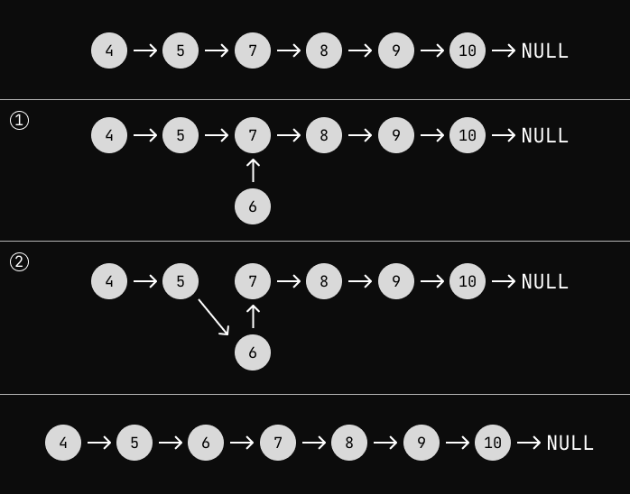

If we want to add a Node/element to an index first we need to traverse to the index.

[1]Then create a new Node that will point to the Node which we just found.

[2]Then make the previous Node point to the newly created Node.

#### What is a pointer?

If you know C/C++ you already know what pointers are, you can skip this section.

When we create a variable and store a value in it, it occupies a space in memory
and the location of that space has an address.

And if we have an address of a location in memory we can change the value stored there.

In mid-level languages like C/C++ and Rust, we have a special data type
that allows us to store the address of a location in the memory
in a special variable called pointers.

So we can have two variables that point to the same location in memory

In interpreted languages like Python and JavaScript, we do not have access
to addresses in memory but have references.

References are like pointers but they point to the actual value rather than the address.

In JavaScript, if you create a variable and assign it to a different variable
it will either copy the value or create a reference

In JavaScript primitive data types `Boolean`, `null`, 
`undefined`, `String`, and `Number` are always get copied

```js
let a = 1;
let b = a; // Copy the value of a into b
b++;

console.log(a) // => 1
console.log(b) // => 2
```
JavaScript has three data types that get passed by reference: `Array`, `Function`, `Object`

```js
let a = { value: 1 };
let b = a;
b.value = 10;

console.log(a.value) // => 10
console.log(b.value) // => 10
```

By using an object we have two variables that points to the same location in the memory.

This is how we will make one Node(a object) point to the other Node(a object).

#### Implementing Linked List

First, let's implement a Node using OOP

```js
class Node {
  constructor(value) {
    this.value = value;
    this.next = null;
  }
}
```

That's it, it's that easy to implement a Node for a linked list.

Now we need a class to store our list and have useful methods to work with our list.

```js
class LinkedList {
  constructor(firstValue) {
    if (firstValue !== undefined && firstValue !== null) {
      this.firstNode = new Node(firstValue);
      this.lastNode = this.firstNode; // Storing a refrence
      this.length = 1;

    } else {
      this.firstNode = null;
      this.lastNode = null;
      this.length = 0;
    }
  }

  push(value) {
    // Add a Node to the end
  }
}
```

What we are doing here is that in the constructor we have a choice to
put the first element in the list when we create a linked list.

We will always have a reference to the first Node in our list and the last Node.
If we have only one Node then it's both the first and the last Node.

We will also keep the count of the nodes in the `length` property.

Now let's implement the push method.

```js
class LinkedList {
  constructor(firstValue) {
    if (firstValue !== undefined && firstValue !== null) {
      this.firstNode = new Node(firstValue);
      this.lastNode = this.firstNode; // Storing a refrence
      this.length = 1;

    } else {
      this.firstNode = null;
      this.lastNode = null;
      this.length = 0;
    }
  }

  push(value) {
    if (this.lastNode) {
      const newNode = new Node(value)
      this.lastNode.next = newNode;
      this.lastNode = newNode;
    } else {
      this.firstNode = new Node(value);
      this.lastNode = this.firstNode; // Storing a refrence
    }
    this.length++;
  }
}
```

Because we have the reference to the last Node of the list adding a new Node is easy.
But first, we need to check if last Node exists because the list could be empty.

If it's empty then do the same thing we did in the constructor. If the last Node
exists then just create a new Node and store it in the `next`
of the last Node and then make the new Node the last Node.

Now we need a way to check if our Linked list is working properly so
let's make a method to print our linked list.

```js
class LinkedList {
  constructor(firstValue) {
    if (firstValue !== undefined && firstValue !== null) {
      this.firstNode = new Node(firstValue);
      this.lastNode = this.firstNode; // Storing a refrence
      this.length = 1;
        
    } else {
      this.firstNode = null;
      this.lastNode = null;
      this.length = 0;
    }
  }

  push(value) {
    if (this.lastNode) {
      const newNode = new Node(value)
      this.lastNode.next = newNode;
      this.lastNode = newNode;

    } else {
      this.firstNode = new Node(value);
      this.lastNode = this.firstNode; // Storing a refrence
    }

      this.length++;
  }

  print() {
    let currentNode = this.firstNode;
    
    while (currentNode) {
      console.log(currentNode.value);
      currentNode = currentNode.next;
    }
  }
}
```

As you can see it's working as intended.

```js
let test = new LinkedList(1);
test.push(2);
test.push(5);
test.push(7);
test.print(); 

// Output
// 1
// 2
// 5
// 7
```

Now let's add a method to add a value to the beginning of the list.

We'll call this `unShift` because that's the method for adding an element
to the beginning of the array is called in JavaScript.

```js
unshift(value) {
  const newNode = new Node(value);
  newNode.next = this.firstNode;
  this.firstNode = newNode;
  
  this.length++;
}
```

What we are doing here is first we make a new Node then make the new Node point
to the first Node in our list then make the new Node our first Node.

```js
let test = new LinkedList(1);
test.push(2);
test.push(5);
test.push(7);
test.unshift(10);
test.print();

// Output
// 10
// 1
// 2
// 5
// 7
```

Up until now, all the method that we have defined has O(1) time complexity
except the print function.

Now we are left with `lookup`, `insert` and `delete` operations.

All of them are similar and have O(n) time complexity.

Let's first implement a `traverse` method because the above method will depend on this.

What the` traverse` method will do is that it'll go through each node
one by one and return the node for the given index, with the index starting at 0.

```js
traverse(index) {
  if (index >= 0 && index < this.length) {
    let i = 0;
    let currentNode = this.firstNode;

    while (i < index && currentNode) {
      currentNode = currentNode.next;
      i++;
    }
    return currentNode;

  } else {
    return null;
  }
}
```

This method looks similar to the print method, what we are doing
different is first we are checking if the index is within the length
then traverse through the list and return the node at the index.

After running this test code we'll get some interesting results.

```js
let test = new LinkedList(1);
test.push(2);
test.push(5);
test.push(7);
test.unshift(10);
console.log(test.lookup(0));
console.log(test.lookup(1));
console.log(test.lookup(2));
console.log(test.lookup(10));

// Output
// Node {
//   value: 10,
//   next: Node { value: 1, next: Node { value: 2, next: [Node] } }
// }
// Node {
//   value: 1,
//   next: Node { value: 2, next: Node { value: 5, next: [Node] } }
// }
// Node {
//   value: 2,
//   next: Node { value: 5, next: Node { value: 7, next: null } }
// }
// null
```

If we print a node we can see the rest of the list after that node.
and If we try of get a node that doesn't exist we get null.

Now implementing the `lookup` method will be easy.

```js
lookup(index) {
  const node = this.traverse(index);

  if (node) {
    return node.value;
  } else {
    return null;
  }
}
```

All we need to do is return the value of the node if it exists.

Now let's do the `insert` method.

```js
insert(index, value) {
  const nodeAtIndex = this.traverse(index);
  const nodeAtPreviousIndex = this.traverse(index-1);

  if (nodeAtIndex) {
    const newNode = new Node(value);
    newNode.next = nodeAtIndex;

    if (nodeAtPreviousIndex) {
      nodeAtPreviousIndex.next = newNode;
    }

    this.length++;
  } else if (index === this.length) {
    this.push(value);
  }
}
```

Let's go step by step to see what this is doing.

First, we take two references, one for the node at the index and
the second one for the node at the previous index.

Then we check if the node at the index exists. If it does then
create a new node and make it point the node at the index.

Then check if the previous node exists and make the previous node point
the to the new node.

If the node at the index does not exist then if the index is the same
as the length of the list use the push method.

Now it's time for the last method in our list.

```js
delete(index) {
  const nodeAtNextIndex = this.traverse(index+1);
  const nodeAtPreviousIndex = this.traverse(index-1);

  if (nodeAtPreviousIndex) {
    nodeAtPreviousIndex.next = nodeAtNextIndex;
  }
}
```

To delete a node at an index you just need to make the previous node point
to the node next to the node at the given index.

Because JavaScript uses a garbage collector the node that no one has
reference to will automatically get deleted from the memory but in other languages
you may have to manually free the memory occupied by the node.

Here is the full implementaion of Linked List

```js
class Node {
  constructor(value) {
    this.value = value;
    this.next = null;
  }
}

class LinkedList {
  constructor(firstValue) {
    if (firstValue !== undefined && firstValue !== null) {
      this.firstNode = new Node(firstValue);
      this.lastNode = this.firstNode; // Storing a refrence
      this.length = 1;

    } else {
      this.firstNode = null;
      this.lastNode = null;
      this.length = 0;
    }
  }

  push(value) {
    if (this.lastNode) {
      const newNode = new Node(value)
      this.lastNode.next = newNode;
      this.lastNode = newNode;

    } else {
      this.firstNode = new Node(value);
      this.lastNode = this.firstNode; // Storing a refrence
    }

    this.length++;
  }

  print() {
    let currentNode = this.firstNode;

    while (currentNode) {
      console.log(currentNode.value);
      currentNode = currentNode.next;
    }
  }

  unshift(value) {
    const newNode = new Node(value);
    newNode.next = this.firstNode;
    this.firstNode = newNode;

    this.length++;
  }

  traverse(index) {
    if (index >= 0 && index < this.length) {
      let i = 0;
      let currentNode = this.firstNode;

      while (i < index && currentNode) {
        currentNode = currentNode.next;
        i++;
      }
      return currentNode;

    } else {
      return null;
    }
  }

  lookup(index) {
    const node = this.traverse(index);

    if (node) {
      return node.value;
    } else {
      return null;
    }
  }

  insert(index, value) {
    const nodeAtIndex = this.traverse(index);
    const nodeAtPreviousIndex = this.traverse(index-1);

    if (nodeAtIndex) {
      const newNode = new Node(value);
      newNode.next = nodeAtIndex;

      if (nodeAtPreviousIndex) {
        nodeAtPreviousIndex.next = newNode;
      }

      this.length++;
    } else if (index === this.length) {
      this.push(value);
    }
  }

  delete(index) {
    const nodeAtNextIndex = this.traverse(index+1);
    const nodeAtPreviousIndex = this.traverse(index-1);

    if (nodeAtPreviousIndex) {
      nodeAtPreviousIndex.next = nodeAtNextIndex;
    }

  }
}

let test = new LinkedList(1);
test.push(2);
test.push(5);
test.push(7);
test.unshift(10);
test.print();
console.log("-----------")
test.insert(3, 11);
test.print();
console.log("-----------")
test.delete(3);
test.print();
```

I know this isn't the most efficient implementation of Linked List because
in the `insert` and `delete` methods I'm calling the `traverse` method twice
which can be avoided but I think this is good enough to show how a Linked List works.

#### Doubly Linked List

What I just showed you is called a Singly Linked List because in it a Node only
points to a single Node.

Imagine a situation where you want to get a Node at a closer index
to the last Node.

In a Singly Linked List, you would have to traverse through the list from the
beginning to almost the end of the list.

It would be great if we can traverse from the end of the list.

This is what Doubly Linked List is for. In Doubly Linked List a Node
points to both the next and previous Node. Which allows us to traverse
from the end of the list.


Let's convert our Singly Linked List to a Doubly Linked List.

Inside the `Node` class you only need to add the `previous` pointer.

```js
class Node {
  constructor(value) {
    this.value = value;
    this.next = null;
    this.previous = null;
  }
}
```

Inside the `LinkedList` class, there is no need to change
anything in the constructor.

Inside the 'push' method you need to add one line:

```js
push(value) {
  if (this.lastNode) {
    const newNode = new Node(value)
    this.lastNode.next = newNode;
    newNode.previous = this.lastNode; // Add this
    this.lastNode = newNode;
  } else {
    this.firstNode = new Node(value);
    this.lastNode = this.firstNode;
  }

  this.length++;
}
```

We also need to do the same for the `unshift` method:

```js
unshift(value) {
  const newNode = new Node(value);
  newNode.next = this.firstNode;
  this.firstNode = newNode;
  this.firstNode.next.previous = this.firstNode; // Add this

  this.length++;
}
```

Let's skip the `traverse` for now, we'll come back to them later.

First, let's fix the `insert` and `delete` methods.

```js
insert(index, value) {
  const nodeAtIndex = this.traverse(index);
  const nodeAtPreviousIndex = nodeAtIndex.previous; // Change this

  if (nodeAtIndex) {
    const newNode = new Node(value);
    newNode.next = nodeAtIndex;
    nodeAtIndex.previous = newNode; // Add this

    if (nodeAtPreviousIndex) {
      nodeAtPreviousIndex.next = newNode;
      newNode.previous = nodeAtPreviousIndex; // Add this
    }
    
    this.length++;
  } else if (index === this.length) {
    this.push(value);
  }
}
```

Now we also don't need to call the traverse function twice!

```js
delete(index) {
  const nodeAtIndex = this.traverse(index);
  const nodeAtNextIndex = nodeAtIndex.next;
  const nodeAtPreviousIndex = nodeAtIndex.previous;

  if (nodeAtPreviousIndex) {
    nodeAtPreviousIndex.next = nodeAtNextIndex;
    nodeAtNextIndex.previous = nodeAtPreviousIndex; // Add this
  }
}
```

Now to test if this works we'll add another print method that will
traverse the list in reverse order(from the last Node to the first Node).

```js
printReverse() {
  let currentNode = this.lastNode;

  while(currentNode) {
    console.log(currentNode.value);
    currentNode = currentNode.previous;
  }
}
```

To test your code run this:

```js
let test = new LinkedList(1);
test.push(2);
test.push(5);
test.push(7);
test.unshift(10);
test.print();
console.log("---- Reverse ----")
test.printReverse();
console.log("---- Insert 11 at 3 ------")
test.insert(3, 11);
test.print();
console.log("---- Reverse ----")
test.printReverse();
console.log("---- Delete at 3 -----")
test.delete(3);
test.print();
console.log("---- Reverse ----")
test.printReverse();
```

The output should look like this:

```
10
1
2
5
7
---- Reverse ----
7
5
2
1
10
---- Insert 11 at 3 ------
10
1
2
11
5
7
---- Reverse ----
7
5
11
2
1
10
---- Delete at 3 -----
10
1
2
5
7
---- Reverse ----
7
5
2
1
10
```

Now that everything is working correctly we can make an
improvement in our `traverse` method.

We can now traverse in the reverse order if the index is closer to
the last item that the first item.

```js
traverse(index) {
  if (index >= 0 && index < this.length) {
    // If index is closer to the first element then traverse from the first element
    if (index < this.length/2) {
      let i = 0;

      let currentNode = this.firstNode;
      while (i < index && currentNode) {
        currentNode = currentNode.next;
        i++;
      }

      return currentNode;
    } else { // If index is closer to the last element then traverse from the last element
      let i = this.length - 1;
      let currentNode = this.lastNode;

      while (i > index && currentNode) {
        currentNode = currentNode.previous;
        i--;
      }

      return currentNode;
    }
  } else {
    return null;
  }
}
```

And here is the full implementation of Doubly Linked List:

```js
class Node {
  constructor(value) {
    this.value = value;
    this.next = null;
    this.previous = null;
  }
}

class LinkedList {
  constructor(firstValue) {
    if (firstValue !== undefined && firstValue !== null) {
      this.firstNode = new Node(firstValue);
      this.lastNode = this.firstNode;
      this.length = 1;
    } else {
      this.firstNode = null;
      this.lastNode = null;
      this.length = 0;
    }
  }

  push(value) {
    if (this.lastNode) {
      const newNode = new Node(value)
      this.lastNode.next = newNode;
      newNode.previous = this.lastNode;
      this.lastNode = newNode;
    } else {
      this.firstNode = new Node(value);
      this.lastNode = this.firstNode;
    }

    this.length++;
  }

  print() {
    let currentNode = this.firstNode;

    while (currentNode) {
      console.log(currentNode.value);
      currentNode = currentNode.next;
    }
  }

  printReverse() {
    let currentNode = this.lastNode;

    while(currentNode) {
      console.log(currentNode.value);
      currentNode = currentNode.previous;
    }
  }

  unshift(value) {
    const newNode = new Node(value);
    newNode.next = this.firstNode;
    this.firstNode = newNode;
    this.firstNode.next.previous = this.firstNode;

    this.length++;
  }

  traverse(index) {
    if (index >= 0 && index < this.length) {
      // If index is closer to the first element then traverse from the first element
      if (index < this.length/2) {
        let i = 0;
        let currentNode = this.firstNode;

        while (i < index && currentNode) {
          currentNode = currentNode.next;
          i++;
        }

        return currentNode;
      } else { // If index is closer to the last element then traverse from the last element
        let i = this.length - 1;
        let currentNode = this.lastNode;

        while (i > index && currentNode) {
          currentNode = currentNode.previous;
          i--;
        }

        return currentNode;
      }
    } else {
      return null;
    }
  }

  lookup(index) {
    const node = this.traverse(index);

    if (node) {
      return node.value;
    } else {
      return null;
    }
  }

  insert(index, value) {
    const nodeAtIndex = this.traverse(index);
    const nodeAtPreviousIndex = nodeAtIndex.previous;

    if (nodeAtIndex) {
      const newNode = new Node(value);
      newNode.next = nodeAtIndex;
      nodeAtIndex.previous = newNode;

      if (nodeAtPreviousIndex) {
        nodeAtPreviousIndex.next = newNode;
        newNode.previous = nodeAtPreviousIndex;
      }

      this.length++;
    } else if (index === this.length) {
      this.push(value);
    }
  }

  delete(index) {
    const nodeAtIndex = this.traverse(index);
    const nodeAtNextIndex = nodeAtIndex.next;
    const nodeAtPreviousIndex = nodeAtIndex.previous;

    if (nodeAtPreviousIndex) {
      nodeAtPreviousIndex.next = nodeAtNextIndex;
      nodeAtNextIndex.previous = nodeAtPreviousIndex;
    }

  }
}

let test = new LinkedList(1);
test.push(2);
test.push(5);
test.push(7);
test.unshift(10);
test.print();
console.log("---- Reverse ----")
test.printReverse();
console.log("---- Insert 11 at 3 ------")
test.insert(3, 11);
test.print();
console.log("---- Reverse ----")
test.printReverse();
console.log("---- Delete at 3 -----")
test.delete(3);
test.print();
console.log("---- Reverse ----")
test.printReverse();
```


#### Reversing a Linked List

This is the most common interview question related to linked list.

And we are going to use a Singly Linked List for this because in
Doubly Linked List there is not need to reverse it.

Remember that we don't to want to print the Linked List in a reverse
order like we did in the Doubly Linked List.

We want to make the given Linked List in the reverse order.

The algorithm to reverse a Linked List looks like this:

```
If the linked list has elements less or equal to 1 then do nothing.

Else get the reference to the first and the second Node to the
`first` and `second` variable and make the `first` LinkedList's last node;

While the second Node exists:
  Store the reference to the `next` of the `second` variable in a `temp` variable.
  Make the `second` variable point to the `first`.
  `first` is now `second`.
  `second` is now `temp`.

Now make the `next` of LinkedList's first Node `null` because it's now the last element.
And make `first` the LinkedList's first element.
```

Now that's confusing as hell but before I explain what is
going on here let's look at the JavaScript code.

```js
reverse() {
  if (this.length <= 1) {
    // Do nothing
  } else {
    let first = this.firstNode;
    let second  = first.next;
    this.lastNode = first;

    while(second) {
      const temp = second.next;
      second.next = first;
      first = second;
      second = temp;
    }

    this.firstNode.next = null;
    this.firstNode = first;
  }
}
```

This is one of the most difficult concepts to understand,
basically what we are doing is we have two pointers that point
to the first and second Node of the list and as we loop through the
list we make the second Node point to the first Node.

It's very hard to understand this algorithm by just reading so I recommend
you to watch this [Youtube Video](https://www.youtube.com/watch?v=G0_I-ZF0S38).

### Stacks and Queues

Stacks and Queues are very similar, there are both linear data-structure
and linear data structures allow us to traverse(go through elements sequentially)
and only one data element can be directly reached.

#### Stacks

A stack is a type of data structure where data elements are stacked on top of each other like a stack of plates. And you can only touch the top plate(when inserting, removing, or peeking).

To get to the bottom plate you will have to remove the top plates one by one.

And if you want to add a data element you can only put it on the top of the stack.

This is called LIFO(Last In First Out) because the last one to get
inserted into the stack(the top plate) will be the first one to get out.


The act of inserting an element into the stack is called Push
and the act of removing an element is called Pop.

Programming languages use the stack data structure to keep track of function calls,
it's known as Call Stack.

When a function gets called it gets pushed into the Call Stack and starts to execute executed.
When another function inside that function gets called the other function gets pushed
to the stack and popped when it's done executing.

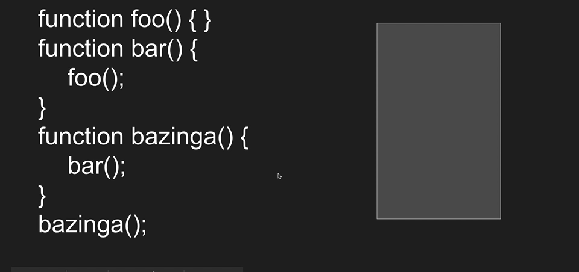

Call Stack has limited space and it can get overflowed if you use a recursive function that
never ends causing the program to crash with Stack Overflow.

Another good example of stack is browser history ( ͡° ͜ʖ ͡°).

When we visit a site it gets pushed to our histroy and when we press the back button it gets poped.

##### Stack Operations

**Lookup** O(n)

**Push** O(1) Push add the element on top of the last element

**Pop** O(1) Pop remove the top last element

**Peek** O(1) The Peek points to the last element.

#### Queues

Queue data structure is like a line of people waiting to
go inside a theater.

The first person in the line will go first inside the theater and the last person in the line will be the last one
to go inside the theater.

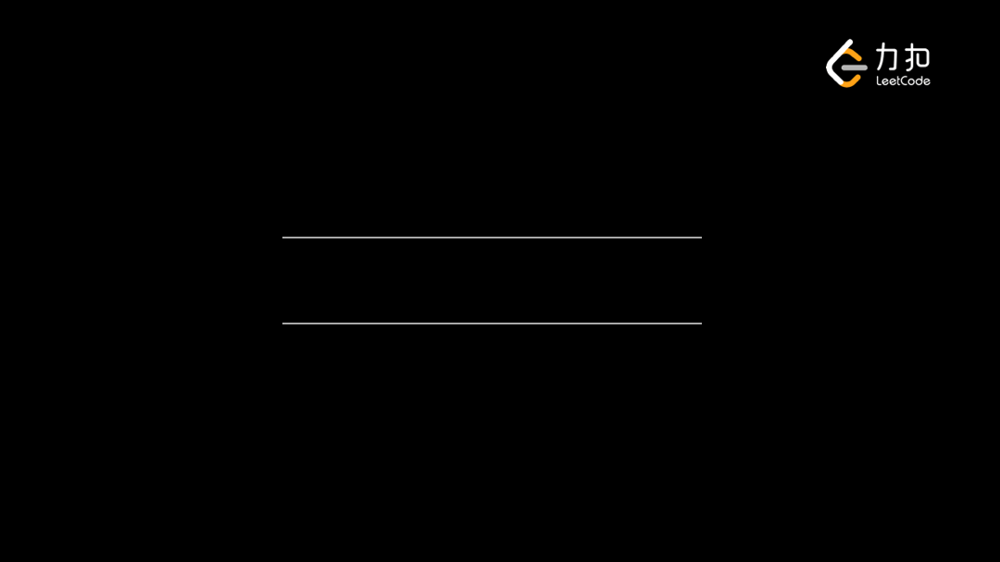

It's opposite of Stack. In Stack the first plate to get in is
the last plate to get out.

But in a Queue the first person to go in is the first one to
go out which is called FIFO(First In First Out).

Queues are useful when you are making an App where you need a waiting list.

##### Queue Operations

**Lookup** O(n) If you follow the constraints otherwise O(1)

**Enqueue** O(1) Enqueue add the element before the last element so the new element becomes the last element.

**Dequeue** O(1) Dequeue remove the first element and the second element becomes the first element.

**Peek** O(1) Peek points to the first element

#### Stack Vs Queue

Stacks are used in areas like undo/redo, browser history, Syntax parsing, and Virtual Machines.

Queues are used for CPU task scheduling, Handling of interrupts, and waiting list in an App.


#### Implementing Stack and Queues

There is no need to create another class for Stack because you can just
use an array because Stack and Array are the same if you only use the push and pop operation and read only the last element of the array.

```js
// Stack using array
let myStack = [1,2,3,4,5];
myStack[myStack.length-1] // Peek
myStack.push(); // In some languages it's called append
myStack.pop(); // Pop
```

We can also implement stack using Linked List but in all Stack-related interview questions you will be given an array.

The Queue on the other hand is similar to Linked List if when removing an element you remove the first element and when adding an element you add the to the end of the list and read only the first element of the list.

```js
let myQueue = new LinkedList(); // The linked list from the previous section

myQueue.lookup(0) // Peek
myQueue.push() // Enqueue
myQueue.remove(0) // Dequeue
```

#### Implement Queue using Stacks

This is the most commonly asking question related to Stack and Queues.

A queue is FIFO (first-in-first-out) but a stack is LIFO (last-in-first-out). This means the newest element must be pushed to the bottom of the stack. To do that we need to unilize two stacks.

```js
class Queue {
  constructor() {
    this.main = [];
    this.temp = [];
  }

  enqueue() {}
  dequeue() {}
  peek() {}
}
```

Because the first element to go in needs to be the first element of our main stack we need to pop and push all the elements from the main stack to the temp stack and then push the new element to the temp stack. After that pop and push all the elements from the temp stack back the the main stack.


```js
enqueue(element) {
  while(this.main.length > 0) {
    this.temp.push(this.main.pop());
  }

  this.temp.push(element);

  while(this.temp.length > 0) {
    this.main.push(this.temp.pop());
  }
}
```

This makes the enqueue method O(n) instead of O(1) but this is a stupid question anyway so we don't care.

Here is the full implementaion with dequeue and peek:

```js
class Queue {
  constructor() {
    this.main = [];
    this.temp = [];
  }

  enqueue(element) {
    while(this.main.length > 0) {
      this.temp.push(this.main.pop());
    }

    this.temp.push(element);

    while(this.temp.length > 0) {
      this.main.push(this.temp.pop());
    }
  }

  dequeue() {
    return this.main.pop();
  }

  peek() {
    return this.main[this.main.length - 1];
  }
}

const myQueue = new Queue();
console.log(myQueue.peek());
myQueue.enqueue('Roy');
myQueue.enqueue('Dishant');
myQueue.enqueue('Burhan');
console.log(myQueue.peek());
myQueue.dequeue();
myQueue.dequeue();
myQueue.dequeue();
console.log(myQueue.peek());
```

### Trees

The tree data structure is based on Linked List and it is called "tree" because
it looks like an upside-down tree.


Here we have a root node that every child descends from.
A node can only have one parent node but can have any number
of children nodes. So we have a uni directional parent-child relationship.

The tree data structure is important because you work with them every day.

The files and folders in your disk are stored in a tree structure.

And if you have coded HTML you may know that also represents a Tree
Structure of HTML Elements.

**Terms in Tree:**

- **Root**: The root of a tree is the topmost node of the tree that has no parent node. There is only one root node in every tree.

- **Edge**: Edge acts as a link between the parent node and the child node.

- **Leaf**: A node that has no child is known as the leaf node. It is the last node of the tree. There can be multiple leaf nodes in a tree.

- **Depth of Node**: The depth of the node is the distance from the root node to that particular node.

- **Height of Node**: The height of the node is the distance from that node to the deepest node of the tree.

- **Height of tree**: The Height of the tree is the maximum height of any node.

#### Why use Trees?

1. One reason to use trees might be because you want to store information that naturally forms a hierarchy. For example, the file system on a computer:


2. Trees (with some ordering e.g., BST) provide moderate access/search (quicker than Linked List and slower than arrays). 

3. Trees provide moderate insertion/deletion (quicker than Arrays and slower than Unordered Linked Lists). 

4. Like Linked Lists and unlike Arrays, Trees don't have an upper limit on the number of nodes as nodes are linked using pointers.

#### Main applicaiton of Trees:

- Manipulate hierarchical data. 
- Make information easy to search. 
- Manipulate sorted lists of data.
- Form of multi-stage decision-making.

#### Binary Tree

A Binary Tree is a type of Tree Data Structure where a parent node can only
have either 0, 1 or two nodes.

Since each element in a binary tree can have only 2 children, we typically name them the left and right child


#### Operations on Binary Tree

**Inserting** O(n)

**Removing** O(n)

**Searching** O(n)

#### Types of Binary Tree

##### Full Binary Tree:

A full Binary tree is a special type of binary tree in which every
parent node/internal node has either two or no children. It is also
known as a proper binary tree.

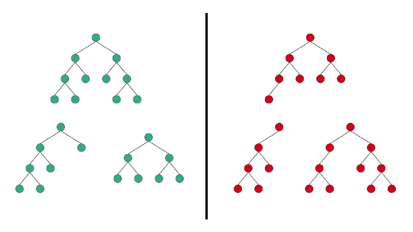

##### Complete Binary Tree:

A Binary Tree is a Complete Binary Tree if all the levels are
completely filled except possibly the last level and the last level
has all keys as left as possible.

A complete binary tree is just like a full binary tree, but with two major differences:

- Every level must be completely filled.
- All the leaf elements must lean towards the left.
- The last leaf element might not have a right sibling i.e. a complete 
binary tree doesn't have to be a full binary tree.

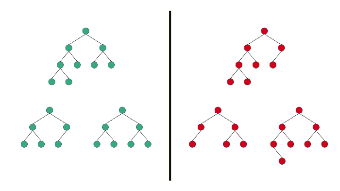

##### Perfect Binary Tree:

A Binary tree is a Perfect Binary Tree in which all the internal nodes have two children and all leaf nodes are at the same level. 

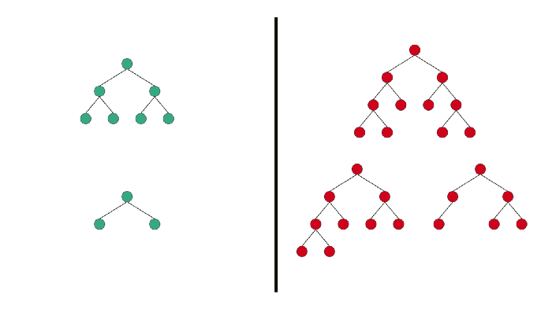

##### Balanced Tree:

A binary tree is balanced if the height of the tree is O(Log n) where n is the number of nodes.

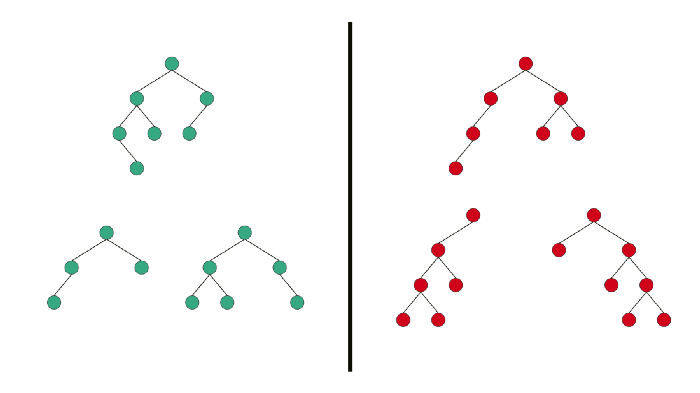

##### Degenerate(or Pathological) Binary Tree:

A Binary Tree is Degenerate Binary Tree where every parent node has only one child node.

This is bacially a Linked List.

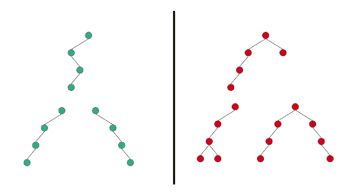

#### Binary Search Tree

Binary Search Tree are really good at searching because each node has a relation with it's child node.

For example take a look at this Tree:

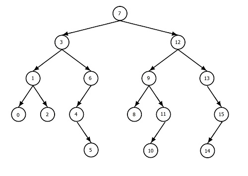

Here the right side of each node is smaller than it's parent node and
the right side of each node is bigger than it's parent node.

And this makes searching very easy because at each node we know what
direction we need to go the find our node. And this is how we avoid
checking through all the nodes.

#### Operations on Search Binary Trees

**Lookup** O(Log n)

**Insert** O(Log n)

**Delete** O(log n)

#### Why O(Log n)?

In computer science, we use Log with base 2 instead of base 10.

And if we put the number of nodes of a Binary Tree and
the log2 function with one added we will get the height of the Binary Tree.

You could look at it like this

log2(n + 1) = h

Where n is the number of nodes and h is the height.

log2(1 + 1) = 1

log2(3 + 1) = 2

log2(7 + 1) = 3

log2(15 + 1) = 4

log2(31 + 1) = 5

And in a Binary Tree the number of steps to get to
the desired node is equal the height of the Tree because
at each node, we know which way we need to go.

So the Big O becomes O(log(n+1)) and after removing the constant
it becomes O(log n).