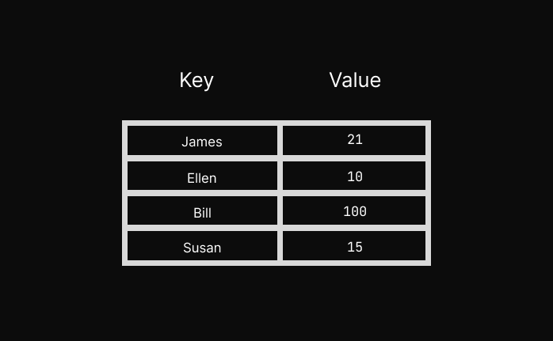
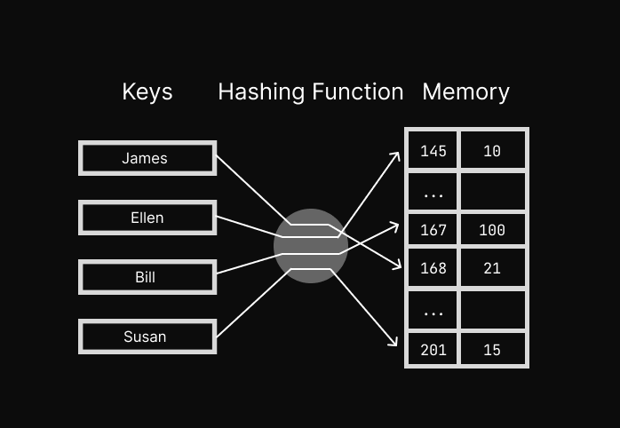
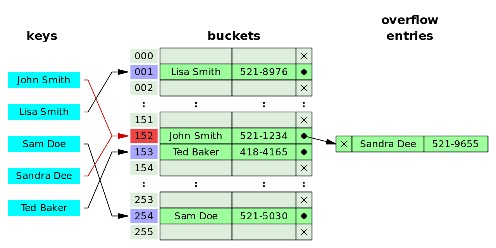

# My notes on DSA and leetcode questions

I'm making my detailed notes here as I'm re-learning DSA.
This can be useful to you even if you don't have any knowledge of DSA.

> **NOTE:** This is in work in process

Contributions are welcomed.

## Table of Contents

1. [Big O](#big-o)
    1. [How to calculate Big O](#how-to-calculate-big-o)
    2. [Space Complexity](#space-complexity)
    3. [Big O Cheat Sheet](#cheat-sheet)
2. [Data Structures](#data-structures)
    1. [Operations on Data Structures](#operations-on-data-structures)
    2. [Arrays](#array)
    3. [Hash Tables](#hash-tables)
    4. [Linked List](#linked-list)
    5. [Stacks and Queues](#queues)
    6. [Trees](#trees)
    7. [Graphs](#graphs)
3. [Algorithms](#algorithms)
    1. [Recursion](#recursion)
    2. [Sorting](#sorting)
    3. [BFS and DFS](#bfs-and-dfs)
    4. [Dynamic Programming](#dynamic-programming)
4. [Coding Problems](#coding-problems)

## Big O

The Big O notation is used to show how well an algorithm scales
in terms of speed and space as the input grows.

It indicates how much time and memory an algorithm
will take to solve a problem for a given input.

Because a code can run faster or slower on different processors
it's not a good way to calculate the efficiency of a program.

That's why we use Big O notation to show how well a code performs
when the input grows.

Big O can also be plotted on a graph:


### How to caculate Big O

To calculate Big O we need to calculate how many operations
the code/function/program will take for the given input.

For example this code:

```js
function getFirstElement(array) {
    return array[0];    // -- O(1)
}
```

This code returns the first element of an array
so it has only one operation so the Big O of this function is O(1).

Let's look at another example:

```js
function sumOfFirstTheeElements(array) {
    let res = 0;    //  -- O(1)

    for (let i = 0; i < 3; i++) {   // -- O(3)
        res += array[i];
    }

    return res;   // -- O(1)
}
```

You might think the Big O of this function is O(5) because
there are five operations in this code.

This is correct but as the input grows the number of operations
stays the same, it does not grow.

So it's a linear time which when denoted as O(1).

Let's look at a code where the numeber of operations grows as the input:

```js
function getIndexOf(array, element) {
    for (let i = 0; i < array.length; i++) { // -- O(n)
        if (array[i] === element) {
            return i;
        }
    }
}
```

This code will find the index of an element in an array by looping over each element.

So in the best case if the element is at the first index
it will only do one operation O(1) but in the worst case,
the number of operations will be equal to the number of inputs
which is denoted by O(n).

When we calculate the Big O we always take the worst case
so the Big O of this code is O(n).

Let's look at another similar example:

```js
function getIndexOfArrayAndSumOfFirstThree(array, element) {
    let index = 0;
    let sum = 0;

    for (let i = 0; i < array.length; i++) { // -- O(n)
        if (array[i] === element) {
            index = i;
            break;
        }
    }

    for (let i = 0; i < 3; i++) {   // -- O(3)
        sum += array[i];
    }

    return { index, sum };
}
```

Here we have a function that does two things:
    - Get the index of an element
    - Get the sum of the first three elements

You might think that the Big O of this function is O(n) + O(3) = O(n+3).
But we don't count the constant numbers like 3 because if the number of elements
is 1000 then having an extra 3 operation doesn't matter to us,
so we remove the constant and this becomes O(n).

> In big tech we often work with big amount of data

But what if we have two for loops?

```js
function getSumAndMultipleOfElements(array) {
    let sum = 0;
    let multiple = 0;

    for (let i = 0; i < array.length; i++) {   // -- O(N)
        sum += array[i];
    }

    for (let i = 0; i < array.length; i++) {   // -- O(N)
        multiple *= array[i];
    }

    return { sum, multiple };
}
```

We have to O(n) here so it should become O(2n) right?

Even though the graph of this is steeper than O(n)
it's still a straight line (a linear graph),
so once again we remove the constant and it becomes O(n).

For two separate collections:

```js
function getSumOfTwoArray(array1, array2) {
    let sum1 = 0;
    let sum2 = 0;

    for (let i = 0; i < array.length; i++) {   // -- O(N)
        sum1 += array1[i];
    }

    for (let i = 0; i < array.length; i++) {   // -- O(N)
        sum2 += array2[i];
    }

    return { sum1, sum 2};
}
```

People often confuse this as O(n) but this is incorrect.
Because we have two inputs we need to show two variables in the notation.
So this is O(a+b).

For nested loops:

```js
function getPairsOfElements(array) {
    let res = [];

    for (let i = 0; i < array.length; i++) {   // -- O(N)
        for (let j = 0; j < array.length; j++) {   // -- O(N)
            res.push([i,j]);
        }
    }

    return res;
}
```

For nested loops like this, we just multiply the operations,
so this becomes O(n * n) = O(n^2).

And the last rule:
Drop Non-dominant terms

```js
function getSumAndPairs(array) {
    let pairs = [];
    let sum = 0;

    for (let i = 0; i < array.length; i++) {   // -- O(N)
        for (let j = 0; j < array.length; j++) {   // -- O(N)
            pairs.push([i,j]);
        }
    }

    for (let i = 0; i < array.length; i++) {   // -- O(N)
        sum += array1[i];
    }
}
```

This looks like it has the complexity of O(n + n^2) but
because n^2 is way more important than n because it grows much faster than n.

When we calculate Big O we are concerned about the scalability of the function
and not the accurate speed of the function.

### Space complexity

Big O is not only used to calculate time compexity
it also used to calculate memory usage.

And there is relation between time and memory usage in computers.

If an algorithm uses less time then It will have to use more memory,
If an algorithm uses less memory then it will take more time to perform.

You cannot have the best of both worlds.

If you are writing a software that runs on low-end systems (like mico conrollers)
you wanna sacrifice speed for low memory usage.

And If you are writing a software that runs on a high-end system with lots of
data to process you wanna sacrifice memory usage for speed.

Let's look at an example to learn how to calculate space complexity:

```js
function sumOfFirstTheeElements(array) {
    let res = 0;    //  -- O(1)

    for (let i = 0; i < 3; i++) {   // -- O(1)
        res += array[i];
    }

    return res;
}
```

When we calculate space complexity we do not include the space occupied by the inputs.

Inside our function, we are only creating two variables and
it does not grow as the input grows so it's constant O(1).

Let's look at another example:

```js
function generateHelloArray(n) {
    let res = [];

    for (let i = 0; i < n; i++) {
        res.push("Hello");
    }

    return res;
}
```

The input n can also be an integer, not just an array.

Here we are creating an array inside the function and the length of the array
is the same as n so the space complexity of this is O(n).

### Cheat sheet

#### The most common Big Os

**O(1)** Constant - no loops

**O(log N)** Logarithmic - usually searching algorithms have log n
if they are sorted (Binary Search)

**O(n)** Linear - for loops, while loops through n items

**O(n log(n))** Log Linear - usually sorting operations

**O(n^2)** Quadratic - every element in a collection needs to be compared
to ever other element. Two nested loops

**O(2^n)** Exponential - recursive algorithms that solves a problem of size N

**O(n!)** Factorial - you are adding a loop for every element

#### Rules

- Always worst case
- Remove constants
  - O(n*2) => O(n)
  - O(n+100) => O(n)
  - O(n/2) => O(n)
- Different variables for different inputs
  - O(a + b)
  - O(a * b)
- Use + sign for loops in order
- Use * for nested loops
- Iterating through half a collection is still O(n)
- Drop Non-dominant terms
  - O(n + n^2) => O(n^2)

#### What Causes Time Complexity?

- Operations (+, -, *, /)
- Comparisons (<, >, ==)
- Looping (for, while)
- Outside Function call (function())

#### What Causes Space Complexity?

- Variables
- Data Structures
- Function Call
- Allocations

## Data Structures

To write an efficient software it's important to learn how to use these different
types of data structures and how they can improve the efficiency of your program.

### Operations on Data Structures

Data structures are simply ways to organise data on our computers and
each data structures have their tradeoffs, some are good at certain operations
and other are good at other operations.

The operations we are talking about are:

- Insertion: Adding more data
- Deletion: Deleting a data
- Traversal: Looping through all the data
- Searching: Searching for a data
- Sorting: Sorting all the data
- Access: Accessing a data

Here is a cheat sheet on operations for all data structures:


### Array

The most basic and commonly used data structure.
Elements of an array are placed next to each other in memory,
mapped with numbers starting at 0.

This makes the access time O(1) if we know the index of our data.
But if you want to search for a data you need to loop over every element
one by one which makes the searching time O(n).

To calculate the length of the array we don't need to loop over the entire array,
we can just store the length of the array inside a variable/property
when we create the array (like in JS `array.length`) and increase/decrease this value
whenever we add or remove an element in the array.

And most languages provide this length property
so the access time of the last element of the array is also O(1).

But adding and removing an element is a different story.

Many languages provide two methods for array `push` and `pop` to insert
and remove an element at the end of the array.

`push` and `pop` have O(1) time complexity.

But if you want to add or remove an element anywhere else in the array
the elements after the index you just changed will have to re-order so in
the worst-case scenario the time complexity of inserting
and removing an element is O(n)

And strings are also an array of characters so the same applies to strings too.

#### Operations On Arrays

**Inserting** O(1) at the end and O(n) at the beginning.

**Deleting** Same as Inserting.

**Lookup** O(1).

**Searching** O(n).

#### Coding Problems

##### Reversing an array

Most programming languages provide a built-in method for reversing an array
but let's look at the ways we can implement this.

First, the most simple way to reverse an array:

```js
function reverse(input) {
    const output = [];

    for (let i = input.length-1; i >= 0; i--) {
        output.push(input[i]);
    }

    return output;
}
```

It loops through the array in reverse order and pushes the value into a new array.

The time and space complexity of this code is O(n), but we can improve this.

```js
function reverse(input) {
    let index1 = 0;
    let index2 = input.length-1;

    while(index2 > index1) {
        let tmp = input[index1];
        input[index1] = input[index2];
        input[index2] = tmp;
        index1++;
        index2--;
    }
}
```

In this function, we are using two indexes that point to the opposite sides
of the array and swap the values of the indexes as they move towards the center.

The above function has a space complexity of O(1) because
it creates a constant amount of space and mutates the input value instead.

This still has the time complexity of O(n) if you are confused.

Now, this function is a un-pure function because it is mutating the input value
which is not always an option so that's why
the previous solution was not that bad for reversing an array.

##### Merging sorted array

Let's solve a more complex interview question.

Q. Given two sorted arrays, merge them into one sorted array.

For example: `[0,4,6]` and `[2,3,7]` should become `[0,2,3,4,6,7]`

Answer:

To solve this problem we need to store two indexes.
[1] One will point to the first element of the first array and
the other one will point to the first element of the second array.

[2] Then compare the two values and increase the index pointing
to the shorter value and push the shorter value to the result array.

Keep doing this until one of the indexes hit the end
[3] then add the remaining elements to the result array.

```js
function mergeSortedArray(array1, array2) {
    // [1]
    let index1 = 0;
    let index2 = 0;
    let result = [];

    // [2]
    while(index1 < array1.length && index2 < array2.length) {
        if (array1[index1] < array2[index2]) {
            result.push(array1[index1]);
            index1++;
        } else {
            result.push(array2[index2]);
            index2++;
        }
    }

    // [3]
    while(index1 < array1.length) {
        result.push(array1[index1]);
        index1++;
    }
    while(index2 < array2.length) {
        result.push(array2[index2]);
        index2++;
    }

    return result;
}
```

Both the time and space complexity of this algorithm is O(a+b).

### Hash Tables

Map(C++), HashMap, Dictionary(Python), Object(JavaScript),and HashTable
are some of the ways to call this data structure and
different languages have slight variations of hash tables.

Hash tables are very important all across computer science.

Hash tables allow us to store data in a key-value pair and
this key is mostly a string or a number(we can use almost any type of data as key).



In hash tables we use key to find the value in memory,
unlike arrays in hash tables data is not stored in sequencial way
but still the access time of hash tables is O(1), it's constant.

Hash tables uses one-way hashing algorithm where the key is the input
and the output is the address in memory and this implementation
of this hashing algorithm is different in all languages.



#### Hash Function

Hash Function is again something that is used all across computer science.
A Hash Function is simply a function that generates a fixed-length string
that looks like some random gibberish for any given input. The output is called Hash.

Eg. `5d41402abc4b2a76b9719d911017c592`

You can play around with a famous hash function MD5 on [this website](http://www.md5.cz/).

There are some key aspects of hash functions:

- The function is a one-way function. Meaning there is no way to know
  what the input was by looking at the output.
- For the same input the output is always going to be the same
- If the input changes even by one bit, it's going to completely change the output

In hash tables, the hash function returns a memory address for a given input.
This makes accessing a block of memory by a key O(1) time.

This is extremely useful because now we can map data to a string(name, etc)
instead of a number like in an array.

The hash function takes some time to calculate the output and it can slow down
accessing data using HashTable. That's why in most languages the HashTable
is implemented by the most efficient hash function.

#### Hash Collisions

Hash Functions are great, they can generate a unique random string for a given input
and two different inputs cannot produce the same hash.

But when we use a hash table the range of the output of the hash function becomes limited.
So sometimes two different output results in the same address in the memory.

To deal with that different implementations have different methods. One of which is
Separate Chaining which uses a linked list to solve this issue but it slows down the
access time from O(1) to O(n) where n is the size of the linked list.

This is how it looks like:



Mostly you don't have to worry about Hash Collision happening
but it's good to know that this happens.

#### Coding Problems

##### First Recurring Element

Q. For a given array find the first recurring element

Example: [2,5,1,2,3,5,1,2,3] => 2

Answer:

To solve this problem we need to loop over every element of the array
and store the seen elements somewhere so that we can check if an element has
been seen before.

We will use hash table to store seen elments.

```js
function firstRecurringElement(input) {
  let seen = {};

  for (let i = 0; i < input.length; i++) {
    // Check if key exists
    if (seen[input[i]]) {
      return input[i];
    }

    // Otherwise store the key with any value
    seen[input[i]] = true;
  }

  // If no recurring element return false
  return false;
}
```

The time and space complexity of this is O(n).

#### Operations on Hash Tables

**Inserting** O(1).

**Deleting** O(1).

**Lookup** O(1).

**Searching** O(1) if searching using key, otherwise O(n).
